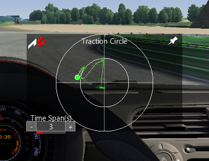

assettocorsa-traction-circle
============================

Plots the acceleration values (G) of the car so the driver can see how well the interaction with traction during cornering and breaking.

Keeps the last X seconds worth of observed values and automatically fades them by age (brighter green values are more recent) leaving a trail.
Additionally a moving average of the accelerations is plotted in white.

Screenshot
==========

Installation
============

Copy the apps/python/traction-circle directory to your:

   assettocorsa\apps\python

directory.  This is often in C:\Program Files (x86)\Steam\steamapps\common\assettocorsa\apps\python.

Roadmap
=======

In the future I would like to:

* Highlight when the slip angle/wheel spin or lockup is happening to flag when the driver has used up too much traction
